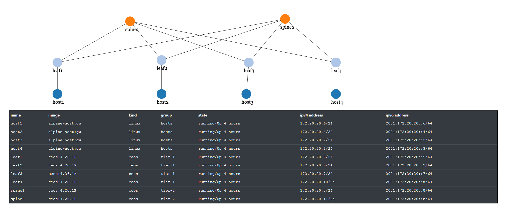

## Fabric / Leaf-Spine Topology

We'll start a simple leaf-spine topology with 4 leaf and 2 spine switches as well as 4 hosts, each of them connected to a single leaf switch. The containers of the example topology consume approx. 5 GB of RAM.

The topology uses private BGP AS as, e.g., also discussed for web-scale data center of, e.g., Facebook, Google, Microsoft or Amazon.

Start the topology using, e.g.:

    user@host: cd acn-lab2-dcn-clab
    user@host: sudo clab deploy -t acn-dcn-fabric.yml

Use the lab sheet to see how many links can be used in the topology.

After the topology is started you can access the hosts and the switches to examine their state.

    user@host:~/acn-lab2-dcn-clab$ sudo clab inspect --all
    +----+--------------------+-------------+-------------------------+--------------+----------------+-------+--------+---------+-----------------+----------------------+
    | #  |     Topo Path      |  Lab Name   |          Name           | Container ID |     Image      | Kind  | Group  |  State  |  IPv4 Address   |     IPv6 Address     |
    +----+--------------------+-------------+-------------------------+--------------+----------------+-------+--------+---------+-----------------+----------------------+
    |  1 | acn-dcn-fabric.yml | acn-dcn-fab | clab-acn-dcn-fab-host1  | fd5a313ad786 | alpine-host:gw | linux | hosts  | running | 172.20.20.6/24  | 2001:172:20:20::6/64 |
    |  2 |                    |             | clab-acn-dcn-fab-host2  | 29a13746507e | alpine-host:gw | linux | hosts  | running | 172.20.20.4/24  | 2001:172:20:20::4/64 |
    |  3 |                    |             | clab-acn-dcn-fab-host3  | a91f406393ee | alpine-host:gw | linux | hosts  | running | 172.20.20.2/24  | 2001:172:20:20::2/64 |
    |  4 |                    |             | clab-acn-dcn-fab-host4  | 7558be8c722f | alpine-host:gw | linux | hosts  | running | 172.20.20.3/24  | 2001:172:20:20::3/64 |
    |  5 |                    |             | clab-acn-dcn-fab-leaf1  | 6f46e54aa433 | ceos:4.26.1F   | ceos  | tier-1 | running | 172.20.20.5/24  | 2001:172:20:20::5/64 |
    |  6 |                    |             | clab-acn-dcn-fab-leaf2  | 29602f65dcfb | ceos:4.26.1F   | ceos  | tier-1 | running | 172.20.20.9/24  | 2001:172:20:20::9/64 |
    |  7 |                    |             | clab-acn-dcn-fab-leaf3  | 275cb4babc72 | ceos:4.26.1F   | ceos  | tier-1 | running | 172.20.20.7/24  | 2001:172:20:20::7/64 |
    |  8 |                    |             | clab-acn-dcn-fab-leaf4  | 679a9876b1d7 | ceos:4.26.1F   | ceos  | tier-1 | running | 172.20.20.10/24 | 2001:172:20:20::a/64 |
    |  9 |                    |             | clab-acn-dcn-fab-spine1 | 104354ace76c | ceos:4.26.1F   | ceos  | tier-2 | running | 172.20.20.8/24  | 2001:172:20:20::8/64 |
    | 10 |                    |             | clab-acn-dcn-fab-spine2 | eb46c24d306b | ceos:4.26.1F   | ceos  | tier-2 | running | 172.20.20.11/24 | 2001:172:20:20::b/64 |
    +----+--------------------+-------------+-------------------------+--------------+----------------+-------+--------+---------+-----------------+----------------------+
    user@host:~/acn-lab2-dcn-clab$ docker exec -it clab-acn-dcn-fab-host1 ip addr show
    ...
    132: eth0@if133: <BROADCAST,MULTICAST,UP,LOWER_UP,M-DOWN> mtu 1500 qdisc noqueue state UP
    ...
    146: eth1@if147: <BROADCAST,MULTICAST,UP,LOWER_UP,M-DOWN> mtu 9500 qdisc noqueue state UP
        link/ether aa:c1:ab:39:9d:2d brd ff:ff:ff:ff:ff:ff
        inet 172.23.24.100/24 scope global eth1
        valid_lft forever preferred_lft forever
    user@host:~/acn-lab2-dcn-clab$ docker exec -it clab-acn-dcn-fab-host2 ip addr show
    ...
    128: eth0@if129: <BROADCAST,MULTICAST,UP,LOWER_UP,M-DOWN> mtu 1500 qdisc noqueue state UP
    ...
    158: eth1@if159: <BROADCAST,MULTICAST,UP,LOWER_UP,M-DOWN> mtu 9500 qdisc noqueue state UP
        link/ether aa:c1:ab:5e:8a:7d brd ff:ff:ff:ff:ff:ff
        inet 172.23.25.100/24 scope global eth1
        valid_lft forever preferred_lft forever
    user@host:~/acn-lab2-dcn-clab$ docker exec -it clab-acn-dcn-fab-host1 ash
    / $ sudo ping 172.23.25.100
    PING 172.23.25.100 (172.23.25.100): 56 data bytes
    64 bytes from 172.23.25.100: seq=0 ttl=61 time=0.462 ms
    64 bytes from 172.23.25.100: seq=1 ttl=61 time=0.320 ms
    ^C
    / $

Logging in to the switches, you can examine the BGP configuration

    ceos1# show running-config [| include (bgp| neighbor | network )]
    deos1# show ip bgp ( summary | neighbors )
    ceos1# show ip route [bgp]

e.g.:

    user@host:~/acn-lab2-dcn-clab$ docker exec -it clab-acn-dcn-fab-leaf1 Cli
    leaf1>sh ip bgp sum
    BGP summary information for VRF default
    Router identifier 11.11.11.11, local AS number 65011
    Neighbor Status Codes: m - Under maintenance
    Neighbor         V  AS           MsgRcvd   MsgSent  InQ OutQ  Up/Down State   PfxRcd PfxAcc
    10.20.30.1       4 65001            251       253    0    0 03:26:24 Estab   3      3
    10.20.30.5       4 65001            251       246    0    0 03:26:25 Estab   3      3
    leaf1>

and try to see the impact of shutting down individual links between leaf and spine switches.

    leaf1> ena
    leaf1# configure terminal
    leaf1(config)# interface <INTERFACE -ID >
    leaf1(config-if-Et1)# (no) shutdown

Using wireshark [https://containerlab.srlinux.dev/manual/wireshark/] you can capture packets on the links in the topology, e.g.:

    user@host:~/acn-lab2-dcn-clab$ sudo ip netns exec clab-acn-dcn-fab-leaf2 ip addr show | grep 172.23
        inet 172.23.25.1/24 brd 255.255.255.255 scope global eth3

    user@host:~/acn-lab2-dcn-clab$ sudo ip netns exec clab-acn-dcn-fab-leaf1 tshark -i eth2
    Running as user "root" and group "root". This could be dangerous.
    Capturing on 'eth2'
        1 0.000000000 172.23.24.100 → 172.23.27.100 ICMP 98 Echo (ping) request  id=0x004f, seq=4/1024, ttl=63
        2 0.000106756 172.23.27.100 → 172.23.24.100 ICMP 98 Echo (ping) reply    id=0x004f, seq=4/1024, ttl=62 (request in 1)
        3 0.112734640 aa:c1:ab:5f:02:1f → LLDP_Multicast LLDP 112 MA/00:1c:73:e0:78:b0 IN/Ethernet2 120 SysN=leaf1
        4 1.000777167 172.23.24.100 → 172.23.27.100 ICMP 98 Echo (ping) request  id=0x004f, seq=5/1280, ttl=63
        5 1.000894629 172.23.27.100 → 172.23.24.100 ICMP 98 Echo (ping) reply    id=0x004f, seq=5/1280, ttl=62 (request in 4)

To simulate layer 1 link failures and see how long it takes until the BGP topology reconverges, it is better not to use shutdown / no shutdown on the links, as BGP routers will notify each other in this event of a controlled (administrative) shutdown. Rather, the underlying link (veth-pair) needs to be temporarily cut, e.g., using an induced packet drop. An easy solution to achieve that is offered by pumba [https://github.com/alexei-led/pumba] that serves as a choas testing tool for Docker containers. The following command add 100% packet loss to the link eth2 in container clab-acn-dcn-fab-leaf1 for 15 minutes:

    user@host:~$ ./pumba_linux_amd64 netem -i eth2 -d 15m loss -p 100 clab-acn-dcn-fab-leaf1

This effectively disables the link to one of the two spines connected to leaf1. The effect can be seen on a ping, e.g., going from host1 connected to leaf1 to host4 connected to leaf4:

    64 bytes from 172.23.27.100: seq=530 ttl=61 time=0.400 ms
    64 bytes from 172.23.27.100: seq=531 ttl=61 time=0.306 ms
    64 bytes from 172.23.27.100: seq=532 ttl=61 time=0.327 ms
    64 bytes from 172.23.27.100: seq=533 ttl=61 time=0.304 ms

    64 bytes from 172.23.27.100: seq=706 ttl=61 time=0.407 ms
    64 bytes from 172.23.27.100: seq=707 ttl=61 time=0.372 ms
    64 bytes from 172.23.27.100: seq=708 ttl=61 time=0.405 ms
    64 bytes from 172.23.27.100: seq=709 ttl=61 time=0.304 ms

The gap shows the effect of the packet drop as well as the time BGP takes to converge.

Undeploy the topology and the containers:

    user@host: sudo clab destroy -t acn-dcn-fabric.yml

## Discussion

* How many links are active in each scenario?
* How is that achieved?
* How can fault tolerance and load balancing in the topology be implemented?