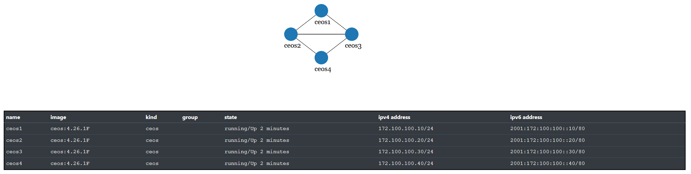

## Scenario 1

Currently needs approx. 3 GB of RAM. We're working on usign KSM/UKSM for the containers to leverage memory deduplication.

**Remark:** The diagram was created using the [graph](https://containerlab.srlinux.dev/cmd/graph/) command of containerlab. Effectively, each line shown in the diagram is composed of two links, e.g., two links from ceos1 to ceos2 etc. Sadly, the graph function of containerlab however only displays one link between individual nodes, even if more/redundant links are defined.

Start the topology using, e.g.:

    user@host: cd acn-lab2-dcn-clab
    user@host: sudo clab deploy -t acn-dcn-scenario1-mstp.yml

Use the lab sheet to see how many links can be used in the topology. E.g. by using:

    user@host:~$ docker exec -it clab-acn-dcn-s1-ceos1 Cli
    ceos1# enable
    ceos1# show lldp nei
    Last table change time   : 0:04:05 ago
    Number of table inserts  : 7
    ...

    Port          Neighbor Device ID       Neighbor Port ID    TTL
    ---------- ------------------------ ---------------------- ---
    Et1           ceos2                    Ethernet1           120
    Et2           ceos2                    Ethernet2           120
    Et3           ceos3                    Ethernet3           120
    Et4           ceos3                    Ethernet4           120

Login to another node in the topogy:

    ceos1# exit
    user@host:~$ docker exec -it clab-acn-dcn-s1-ceos2 Cli
    ceos1# ena
    ceos1# show spanning-tree
    VL1
        Spanning tree enabled protocol rapid-pvst
        Root ID    Priority    32769
                    Address     001c.7342.119f
                    Cost        20000 (Ext) 0 (Int)
                    Port        1 (Ethernet1)
                    Hello Time  2.000 sec  Max Age 20 sec  Forward Delay 15 sec

        Bridge ID  Priority    32769  (priority 32768 sys-id-ext 1)
                    Address     001c.738b.6828
                    Hello Time  2.000 sec  Max Age 20 sec  Forward Delay 15 sec

    Interface        Role       State      Cost      Prio.Nbr Type
    ---------------- ---------- ---------- --------- -------- --------------------
    Et1              root       forwarding 20000     128.1    P2p
    Et2              alternate  discarding 20000     128.2    P2p
    Et3              designated forwarding 20000     128.3    P2p
    ...

Undeploy the topology and the containers:

    user@host: sudo clab destroy -t acn-dcn-scenario1-mstp.yml

The state of deployments can be shown using:

    user@host: sudo clab inspect --all

## Discussion

* What are the benefits of STP (or in this special case the variant MSTP/PVST+)?
* How many links are active in each scenario?
* Why? How is that achieved?

[Next: Scenario 2](scenario2-lacp.md)
